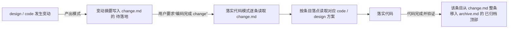

# 变更账本机制（change.md + archive.md）

> 定义任务根目录 `elaboration/<task-slug>/change.md` 与 `archive.md` 的结构与生命周期。任一模式发生方案变动、或落实代码归档时按需加载本文件。

每个总功能点根目录固定有一对账本文件，作为该任务所有 design 文档与 code 框架共用的变更记录，**按「是否已落实」拆成两个文件**：

- `change.md`（只含 `## 待落地`）：已发生但**尚未落实到代码**的方案变动（design / code 任一层的改动）。**日常工作只读这个文件**——它始终只有未完成的变动，体量小、随读随用。
- `archive.md`（只含 `## 已归档`）：已经落实到代码并归档的变动。只在需要追溯历史变动时才读取，不随日常模式加载。

**任务一开始就创建两个空壳**：技术方案模式创建任务目录时，同时创建 `change.md`（含 `## 待落地` 空标题）与 `archive.md`（含 `## 已归档` 空标题），不等到第一次有变动 / 归档才补建。

## 生命周期

固定为「写入 → 落实 → 归档」，跨模式协作：



- **写入（技术方案 / 代码方案模式）**：每次 design 文档或 code 框架发生变动后，把这次变动总结追加到 `change.md` 的 `## 待落地`，注明变动主题、涉及的落点（跨 design / code 两层）与「待落实」状态。**`## 待落地` 内不允许重复或重叠内容**：新变动若与某条已有未落实条目指向同一处或互相重叠，合并进那一条而不是新增，使每条相互独立、不冗余。
- **落实（落实代码模式 · “编码完成 change”）**：从 `change.md` 的 `## 待落地` 读取待落实条目 → 按条目落点读取 code 框架对应源文件（及必要的 design 依据）→ 据此落实代码（见 `reference/implement-code.md`）。
- **归档（落实代码模式）**：某条变动对应代码完成并通过验证后，把该条目**从 `change.md` 整条移入 `archive.md` 的 `## 已归档` 顶部**（新归档在上，近期变动易查），标注完成批次（commit 或时间）。未完成不归档；产出模式不动 `archive.md`。

## 条目建议格式

变动摘要要写清「改了什么、为什么」，并把落点按两层产物标全（一条变动通常同时牵动 design / code 多篇），便于落实代码时精确定位：

```markdown
# Change（change.md）

> 只保留「待落地」；条目落实后整条移入 archive.md。

## 待落地

### <变动主题> — <涉及的功能 / 层>
- 变动摘要：<这次方案改了什么、为什么>
- 落点：`design/<concern>.md` 的 <节> · `code/Sources/<模块>/<层>/<文件>.swift` 的 <类型 / 方法>
- 状态：待落实
```

```markdown
# Archive（archive.md）

> change.md 的已归档条目；日常只读 change.md，追溯历史时才读本文件。

## 已归档

### <变动主题> — <涉及的功能 / 层>
- 变动摘要：<…>
- 落点：<…>
- 状态：已完成（<commit 或时间>）
```

- 落点按实际牵动的层写全，只动一层就只写一层；跨层变动把 design / code 落点都列出。
- 同一条未落实变动反复调整时更新同一条目，不重复追加。
- 未决问题不进 change.md，走 `question.md`（见 `reference/question-list.md`）。
- 旧任务若 `change.md` 内仍带 `## 已归档` 段落，首次归档操作时顺手把整段迁移到 `archive.md`，此后维持两文件结构。
