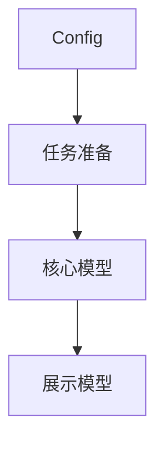
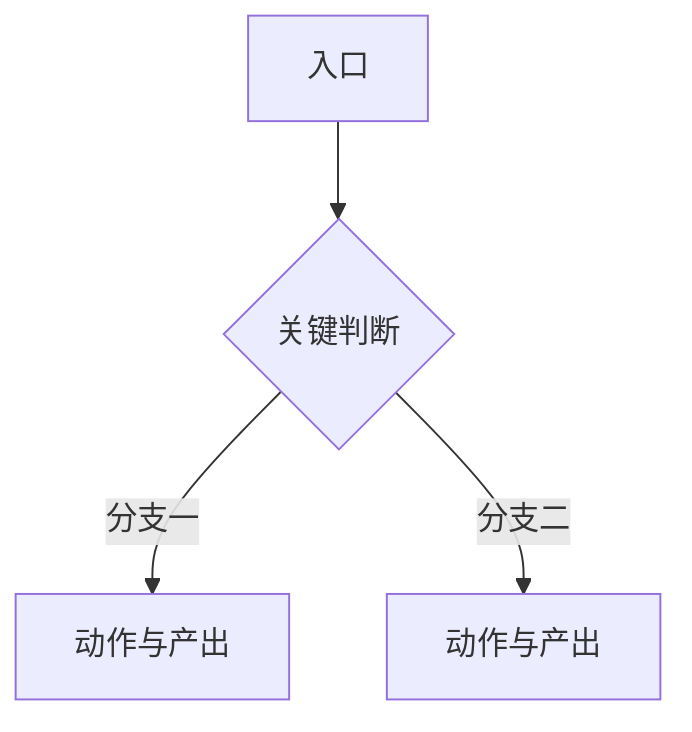

# 技术方案模式

> 仅在启动确认门确认为「技术方案」模式后加载本文件。

**单一聚焦：本模式只制定和收敛 `design/*.md`。** design 是整个任务的最高事实依据，每篇文档承载两部分内容：先写清**产品意图**（用户视角的可见行为：进入页面看到什么、什么时候触发、交互怎么走、边界怎么表现、成功标准是什么），再产出对齐它的**技术方案**（模型职责与事实源、管线流程、状态机、生命周期、数据流）。不落到逐属性/逐方法的代码抽象（那是 code 层）、不写真实 Swift 代码、不改项目代码。

第一准则：技术方案必须对齐产品意图；所有模型职责、事实源、管线步骤、状态流转、数据流都必须能回溯到某条用户可见行为、目标或边界（本篇或交叉链接的其它 design 文档里写明的）。**产品意图的确定性高于技术方案**：两者冲突时修技术方案，不为实现便利反写产品意图——只有当产品意图自身有明确问题（目标自相矛盾、范围有漏洞、与客观事实不符）并经用户确认时才改它，改后同步传导到技术方案。

产品意图与技术方案的分工边界（同一篇文档内）：

- **产品意图讲「用户体验到什么」**——进入 / 触发后看到什么、什么条件下怎么表现、交互与可用性、边界与异常的用户可见结果。措辞保持用户视角，尽量不出现代码类型名。
- **技术方案讲「技术上怎么运转、谁说了算」**——模型的**职责**与**事实源**、管线的**流程**、状态机的**流转**、数据流的**方向**。可以出现模型/实体/类型/角色的**代码名称**（如某 Entity / Manager / Grouper）标识事实源、状态载体与数据流边界，但**不写文件路径、不列逐属性、不写逐方法的代码抽象**——那些留给代码方案模式。

## 产品意图推导要求（产品专家视角）

- 产品意图不是被动记录需求；先明确目标、假设、用户场景、成功标准和约束，再判断方案是否合理。
- 当用户提出一个明确方案时，把它视为待评估的候选方案，而不是已确认的定稿；围绕它的用户价值、流程闭环、交互成本、边界条件和取舍分析合理性。
- 从产品专家视角审视用户价值、流程闭环、交互成本、边界条件、异常与恢复路径、可用性矩阵；如果发现更简单、更符合用户直觉的产品路径，主动提出备选方案，说明收益、代价、风险和推荐判断，不要为了推进而默认接受不合理方案。
- 头脑风暴阶段可以发散多个候选方案、反例和取舍，但最终要收敛到一套明确推荐的最佳方案；写入 `design/*.md` 时只沉淀已确认的推荐方案与明确排除的方案，未决问题移交 `question.md`（见 `reference/question-list.md`）。

## 执行步骤

1. 读 `README.md` 校验已有覆盖，定位或新建 design 文档：**按技术关注点**在 `design/` 下建 kebab-case 文档（如 `models` / `scan-pipeline` / `scan-lifecycle` / `home` / `detail`），一个关注点一篇；把新文档登记进 `README.md`。
2. 先确认产品意图足够明确（目标、用户场景、成功标准、边界数值）；不明确则先按「产品意图推导要求」与用户收敛，未决项写入 `question.md`，不凭空写技术方案。
3. 通常先写 `design/models.md`（核心模型职责、类别、事实源原则、数据流总览），它是其它 design 文档引用的基准；再写各流程 / 状态 / 渲染关注点文档。
4. 产品意图用「可用性矩阵表（触发→表现）+ 状态表现表（情况→页面表现）+ Mermaid 流程图」表达，穷举「触发 / 条件 → 用户可见结果」的映射，避免只写一条主链路而漏掉边界；技术方案用「模型一览表 + 事实源表 + 管线流程图/步骤表 + 状态机 + 决策矩阵」表达，模型只写**职责**与**关键规则**，不展开属性清单。
5. 写清关键约束与「不做什么」（含明确排除的产品做法与技术做法及否决理由），让读者能从产品意图、模型职责、事实源、管线流程、状态流转、数据流几个角度审查方案；不要提前落到 code 框架或改项目代码。
6. 检查技术方案每一项都能映射回产品意图。不能映射的方案条目**默认删除**；只有当确属产品意图漏掉必要目标时，才先补产品意图并让用户确认，再据此补技术方案——绝不为了迁就实现反向改写产品意图。
7. **本次 design 有变动时，把变动摘要写入 `change.md` 的 `## 待落地`**（见 `reference/change-log.md`），注明变动主题、涉及的 design/code 落点与「待落实」状态；未决问题写入 `question.md`。不在本模式落实代码，也不动 `archive.md`。

## `design/<concern>.md` 建议结构

技术关注点分两类，结构略有差异：

### A. 模型类（`design/models.md`）

````markdown
# 技术方案 · 模型设计

> 定义本功能涉及的核心模型职责、关系与事实源原则。

## 1. 核心模型一览

| 模型 | 类别 | 职责 | 关键规则 |
| --- | --- | --- | --- |
| `<模型名>` | Entity / Item / Node / Value / State / Config | <一句话职责> | <关键约束，带明确数值> |

## 2. 事实源原则（谁说了算）

| 关注点 | 事实源 | 说明 |
| --- | --- | --- |
| <某判断> | `<模型 / 字段>` | <为什么由它说了算> |

## 3. 模型关系与数据流



## 4. 关键约束（不做什么）

- <明确排除的技术做法及理由>
````

### B. 流程 / 状态 / 渲染类（`design/scan-pipeline.md` / `home.md` 等）

````markdown
# 技术方案 · <关注点名>

> <一句话点明本文覆盖的技术关注点与对应的用户场景>；相关关注点见交叉链接。

## 1. <产品行为（用户可见表现）>

<一句话说明这个能力对用户是什么；先讲清用户看到什么，再进技术方案>

| 触发 / 条件 | 用户可见结果 |
| --- | --- |
| <用户操作 A> | <表现> |
| <系统事件 B> | <表现> |

## 2. 角色 / 参与者

| 角色 | 职责 |
| --- | --- |
| `<类型名>` | <职责> |

## 3. <主流程>



| 步骤 | 动作 | 依赖 | 产出 |
| --- | --- | --- | --- |
| 1 <步骤名> | <做什么> | <输入> | <输出> |

## 4. 状态 / 决策矩阵

| 状态 / 条件 | 动作 |
| --- | --- |
| <条件> | <要做什么> |

## N. 不做什么

- <明确排除的产品 / 技术做法及理由>
````

## `design/<concern>.md` 写作要求

- **产品意图先行**：每个关注点先讲清用户可见行为（进入 / 触发后看到什么、边界与异常表现），再写技术方案；技术方案只写产品意图已确认或可直接推导出的内容，不为实现便利新增需求、扩大范围。
- **产品意图可落地、可验证**：门槛、批量、条数、时长、比例等都写成明确数字或数值区间，不能用“一批”“一部分”“若干”“少量”这类模糊说法；数字还没定的放进 `question.md` 并写清要用户拍板的数值。
- **模型只写职责与事实源**：`design/models.md` 用表格给每个模型写「类别 + 一句话职责 + 关键规则」，**不展开属性清单、不写方法设计**——逐属性/逐方法留到 code 框架的 Model 层。
- **可以出现代码类型名**（模型/实体/角色/工具类/Manager/Grouper 等）以标识事实源、状态载体、数据流边界；但**不写文件路径、不写 Swift 代码、不写函数签名**。落到文件/属性/方法级的一律留给 code 层；产品意图段落尽量保持用户视角措辞。
- **优先用图表表达**：「触发→表现」「状态→页面」「情况→结果」映射 → Markdown 表格穷举；端到端主流程与分支 → Mermaid `flowchart`；模块/角色交互时序 → `sequenceDiagram`；状态机、阶段流转 → `stateDiagram`；有序步骤 →「步骤表」；状态/条件到动作映射 →「决策矩阵表」。一份方案里这些可叠加（先 flowchart 看全局、再步骤表看细节）。
- **交叉链接维系一致性**：同一事实、规则只在最合适的一篇里写一次（通常 models 定义事实源、流程篇引用），其它篇需要时用相对链接引用（如 `见 [scan-reconcile](./scan-reconcile.md) §5`），不重复展开；内容要适合人阅读，尽量精简，不重复强调同一事实或结论。
- 每篇「不做什么 / 关键约束」逐条写明确排除的做法（含产品层面与技术层面）及理由，避免下游反复纠结。
- 仍需用户拍板的问题、悬而未决的取舍、外部依赖不写进正文，移交 `question.md`（带完整问题分析与选项）。

## 检查（合理性审查）

检查意图下，审查 `design/*.md` 自身合理性——design 是最上游，没有更上游可比对，查三件事，**不审查 code 框架与项目代码**：

- **产品意图自洽**：目标自洽、范围完整、各能力的用户流程闭环；可用性矩阵 / 状态表现表是否穷举了关键触发与边界，有没有漏掉的「触发→表现」组合；数值是否明确（门槛/批量/条数/时长/比例都不留模糊词）；与已知客观事实、用户直觉是否冲突。
- **技术方案对齐产品意图**：逐条核对模型职责、事实源、管线流程、状态流转、数据流能否回溯到某条用户行为 / 目标 / 边界。
- **内部自洽与越界**：事实源唯一、状态流转无死角、跨文档引用不矛盾；是否越界写进了 code 层内容（文件路径 / 逐属性 / 逐方法 / Swift 代码）——越界内容应下沉到 code 或删除。

标记：
- 产品意图目标矛盾 / 流程互斥 / 与客观事实冲突、技术方案做了产品意图没要求或与之相悖的事（需求 / 方案偏移）、事实源自相矛盾、越界写了代码抽象 → `[错误]`。
- 产品意图该定的目标/数值留白（或仍挂在 `question.md` 未拍板），或产品意图有明确要求但技术方案未覆盖 → `[警告]`。

## 汇报要求

说明对应 design 文档更新内容：产品意图侧的变化（要做的 / 不做的、推荐理由、关键取舍）与技术方案侧覆盖的模型职责、事实源、管线与状态流转，仍未覆盖的产品意图项，以及移交 `change.md` / `question.md` 的变动与待确认项。
