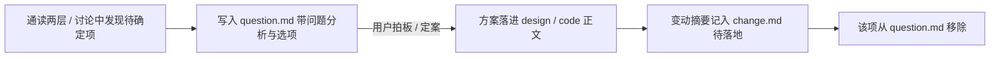

# 方案审查清单机制（question.md）

> 定义任务根目录 `elaboration/<task-slug>/question.md` 的结构与生命周期。通读两层方案做合理性审查、或收集待用户拍板的问题时按需加载本文件。

每个总功能点根目录固定有一个 `question.md`，是通读 design / code 两层后的**方案审查清单**——只保留**待确定项**（带完整问题分析与选项）。**定案并落文档后即从清单移除**；已定案的内容归 design / code 正文与 `change.md`，不滞留在 question.md。

**任务一开始就创建 question.md**：技术方案模式创建任务目录时，同时创建空壳（含引言与 `## Question` 空标题、正文写 `(当前无待确定项)`），不等到第一次有问题才补建。

## 编号含义

清单项按性质编号，便于逐条定案与引用：

| 前缀 | 含义 | 典型来源 |
| --- | --- | --- |
| `A` | **矛盾 / 漏洞** | 两层内部或跨层自相矛盾、产品意图与技术方案冲突、流程有死角、事实源冲突、时序绕过 |
| `B` | **待拍板决策** | 需要用户在多个候选方案 / 数值间选择的取舍 |
| `C` | **风险确认** | 已知风险、边界代价、需要用户确认「接受」的项 |

## 生命周期



- **写入**：审查或讨论中发现的矛盾（A）、待决策（B）、待确认风险（C），带**完整问题分析 + 候选选项 + 推荐判断**写入 `## Question`；不写只有结论没有分析的空条目。
- **定案**：用户拍板或讨论收敛后，把结论落进对应 design / code 正文，变动摘要记入 `change.md` 的 `## 待落地`（见 `reference/change-log.md`）。
- **移除**：定案并落文档后，该项**从 question.md 移除**（不保留「已定案」历史——历史归 `change.md`）；清单清空时正文写 `(当前无待确定项)`。

## 条目建议格式

```markdown
# Question

> 通读 `elaboration/<task-slug>/`（design N + code N 模块）后的方案审查清单，只保留待确定项（带完整问题分析与选项）；定案并落文档后即从清单移除，文档变动记录见 change.md。
> 编号含义：A = 矛盾 / 漏洞、B = 待拍板决策、C = 风险确认。

## Question

### A1 <矛盾 / 漏洞主题>
- 问题：<哪里自相矛盾 / 有漏洞 / 时序绕过，涉及哪些文档>
- 分析：<为什么是问题、影响什么>
- 选项：① <方案一 + 代价> ② <方案二 + 代价>
- 推荐：<推荐哪个及理由 / 待用户拍板>

### B1 <待决策主题>
- 问题：<要在什么之间做取舍>
- 选项：① <…> ② <…>
- 推荐：<…>

### C1 <风险主题>
- 风险：<已知风险 / 边界代价>
- 处置：<如何兜底 / 是否接受，待用户确认>
```

- 无待确定项时正文只写 `(当前无待确定项)`，保留引言与编号说明。
- 检查（合理性审查）回合报出的 `[错误]` / `[警告]`（见各模式 Reference）中需要用户拍板的，沉淀为 question.md 条目；能直接按偏移处理修下游的不进清单。
